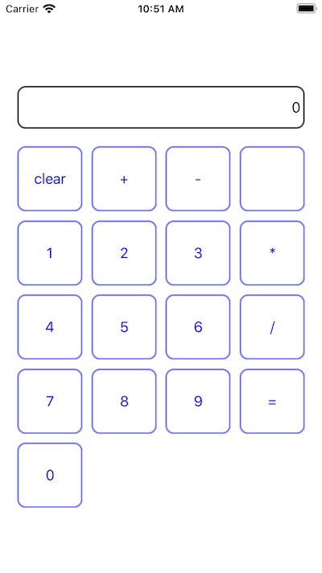

# RxSwiftCalculatorExample

## Calculator


## RxSwift SwiftPackage
[RxSwift github](https://github.com/ReactiveX/RxSwift.git)

## Usage RxSwift
### CalculatorViewModel
```swift
class CalculatorViewModel {
    
    var calculatorButtonVariable = BehaviorRelay<CalculatorButton?>(value: .zero)
    var calculatorObservable: Observable<String>!
    
    ...
    
    // Setup calculatorObservable
    private func setupObservable() {
        
        calculatorObservable = calculatorButtonVariable.asObservable().map{ calculatorButton in
            
            switch calculatorButton {
            case .clear:
                self.clear()
                break
            case .plus:
                self.plus()
                break
            case .subtract:
                self.subtract()
                break
            case .multiply:
                self.multiply()
                break
            case .divide:
                self.divide()
                break
            case .equals:
                self.equal()
                break
            case .empty:
                break
            default:
                let number = calculatorButton?.rawValue ?? ""
                self.number(number)
            }
            
            return self.labelString
        }
    }
}
```

### ViewController
```swift
class ViewController: UIViewController {

    fileprivate let disposeBag = DisposeBag()
    
    let calculatorResultLabel: UILabel           = CalculatorResultLabel()
    let collectionView: UICollectionView         = CalculatorCollectionView()
    let collectionViewData: [CalculatorButton]   = [.clear, .plus, .subtract, .empty,
                                                    .one, .two, .three, .multiply,
                                                    .four, .five, .six, .divide,
                                                    .seven, .eight, .nine, .equals,
                                                    .zero]
    let calculatorViewModel: CalculatorViewModel = CalculatorViewModel()
    
    override func viewDidLoad() {
        super.viewDidLoad()
        
        setupUI()
        
                // Subscribe to calculatorObservable on calculatorViewModel
        calculatorViewModel
            .calculatorObservable
            .subscribe(onNext: { reslutLabelString in
                self.calculatorResultLabel.text = reslutLabelString
                
            }).disposed(by: disposeBag)
        
        // Rx collectionview - observe items of the collection view
        let items = Observable.just(collectionViewData)
        items
            .asObservable()
            .bind(to: collectionView.rx.items(cellIdentifier: String(describing: CalculatorButtonCell.self), cellType: CalculatorButtonCell.self)) { row, data, cell in
                cell.buttonLabel.text = data.rawValue
        }.disposed(by: disposeBag)
        
        // Rx collectionview - change calculatorButtonVariable on calculatorViewModel when select a button cell of the collection view
        collectionView
            .rx
            .modelSelected(CalculatorButton.self)
            .bind(to: calculatorViewModel.calculatorButtonVariable)
            .disposed(by: disposeBag)
    }
}
```

